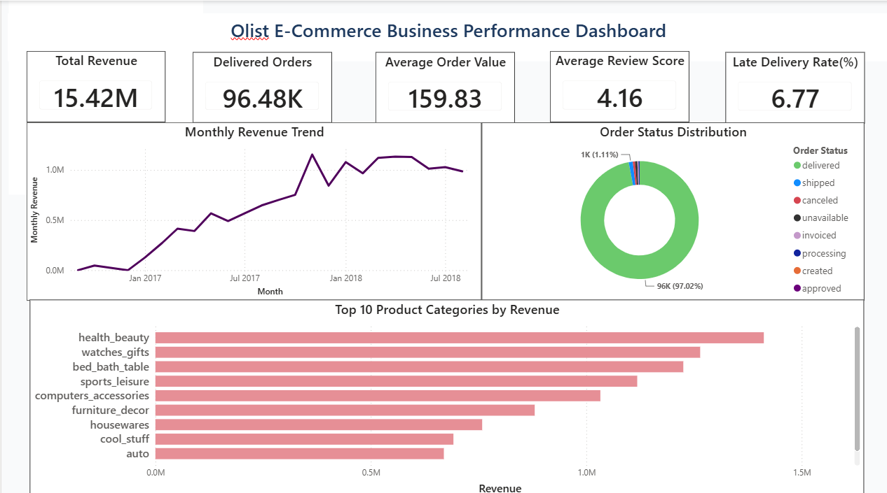
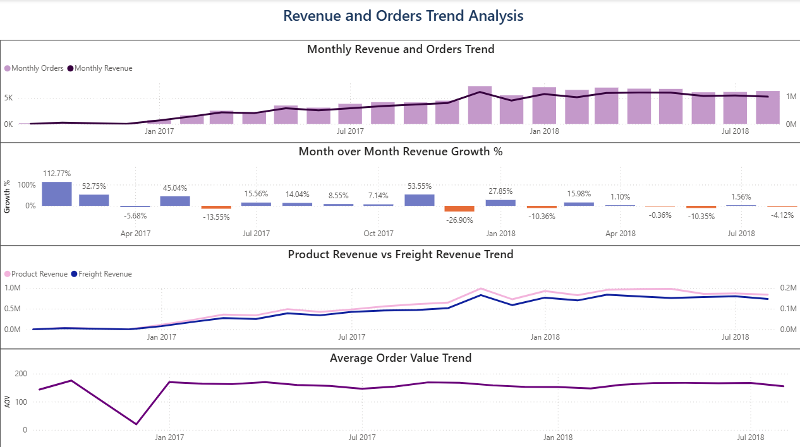
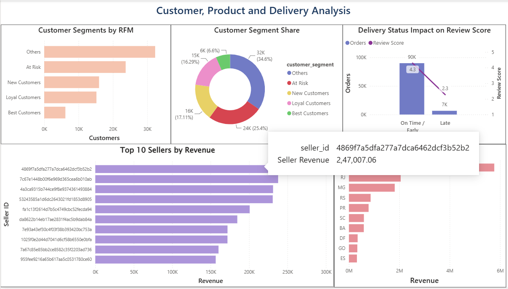
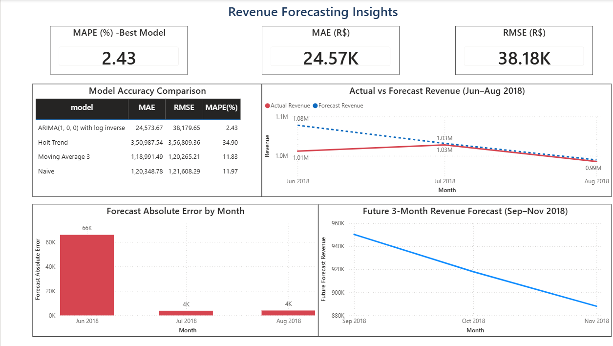

# Olist E-Commerce Business Performance Analysis

## Project Overview

This is an end-to-end data analytics project on the Brazilian Olist E-Commerce dataset. The project analyzes order performance, revenue trends, customer behavior, seller performance, delivery efficiency, review scores, and future revenue forecasting.

The project uses SQL for structured analysis, Python for exploratory data analysis and feature engineering, Power BI for dashboarding, and ARIMA for time series forecasting.

---

## Business Problem

E-commerce companies need to understand revenue performance, customer behavior, product category performance, delivery issues, and future sales trends. This project answers key business questions such as:

- How is revenue changing over time?
- Which product categories and sellers generate the most revenue?
- Which customer segments are most valuable?
- How does delivery performance affect review scores?
- Can future revenue be forecasted using historical sales data?

---

## Tools and Technologies Used

- SQL Server
- Python
- Pandas
- NumPy
- Matplotlib
- Seaborn
- Statsmodels
- Power BI
- GitHub

---

## Dataset

The project uses the Brazilian E-Commerce Public Dataset by Olist. The dataset contains information related to orders, customers, sellers, products, payments, reviews, and delivery timelines.

Main tables used:

- Orders
- Order Items
- Customers
- Sellers
- Products
- Payments
- Reviews
- Product Category Translation

---

## Project Workflow

### Phase 1: SQL Analysis

SQL was used to explore the relational database and answer business questions related to orders, revenue, customers, sellers, product categories, and delivery status.

### Phase 2: Python EDA and Feature Engineering

Python was used for data cleaning, merging datasets, creating analytical features, and preparing summary tables for dashboarding.

Key features created:

- Order month
- Order value
- Delivery days
- Delivery delay days
- Late delivery flag
- Monthly sales summaries
- Category performance
- Seller performance
- Customer state analysis
- RFM customer segmentation

### Phase 3: Power BI Dashboard Preparation

Cleaned and aggregated CSV files were exported from Python and used in Power BI to build a business dashboard.

### Phase 4: Time Series Forecasting

Monthly revenue was forecasted using ARIMA. The ARIMA model was compared with baseline models such as Naive Forecast, Moving Average, and Holt Trend.

### Phase 5: Power BI Dashboard

A 4-page Power BI dashboard was created to present business insights clearly.

Dashboard pages:

1. Executive Overview
2. Revenue and Orders Trend Analysis
3. Customer, Seller and Delivery Analysis
4. Revenue Forecasting Insights

---

## Key Insights

- Total delivered orders were approximately 96.48K.
- Total revenue was approximately 15.42M.
- Average order value was around 159.83.
- Average review score was 4.16.
- Delivered orders formed the majority of all orders.
- Health and beauty, watches/gifts, and bed/bath/table were among the top revenue-generating product categories.
- RFM analysis identified important customer groups such as Loyal Customers, At Risk Customers, New Customers, and Best Customers.
- Late deliveries were associated with lower review scores.
- ARIMA produced the best forecasting performance among tested models.

---

## Forecasting Results

The best-performing model was ARIMA(1,0,0) using log-transformed revenue.

| Model | MAE | RMSE | MAPE |
|---|---:|---:|---:|
| ARIMA(1,0,0) with log inverse | 24,573.67 | 38,179.65 | 2.43% |
| Moving Average 3 | 118,991.49 | 120,265.21 | 11.83% |
| Naive | 120,348.78 | 121,608.29 | 11.97% |
| Holt Trend | 350,987.54 | 356,809.36 | 34.90% |

The ARIMA model achieved the lowest error and was selected as the final forecasting model.

---

## Dashboard Preview

### Executive Overview



### Revenue and Orders Trend Analysis



### Customer, Seller and Delivery Analysis



### Revenue Forecasting Insights



---

## Repository Structure

```text
Olist-Ecommerce-Analytics/
│
├── README.md
│
├── sql/
│   └── SQL analysis files
│
├── notebooks/
│   ├── phase2_eda_feature_engineering.ipynb
│   └── phase4_time_series_forecasting.ipynb
│
├── powerbi/
│   ├── olist_dashboard.pbix
│   └── dashboard_screenshots/
│
└── exports/
    └── Power BI export CSV files
